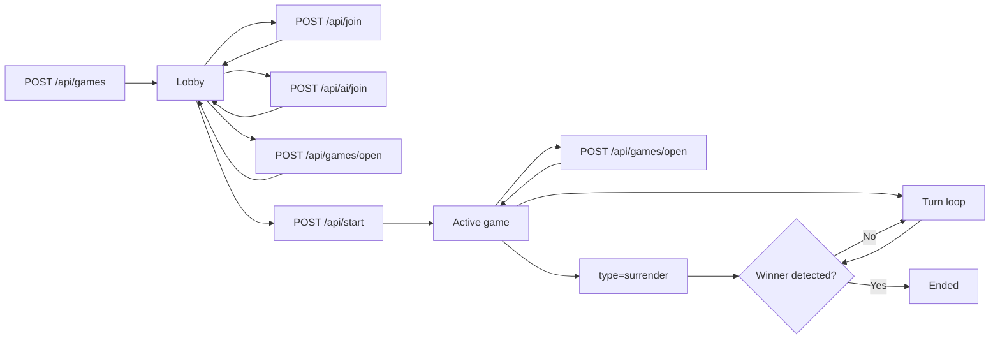
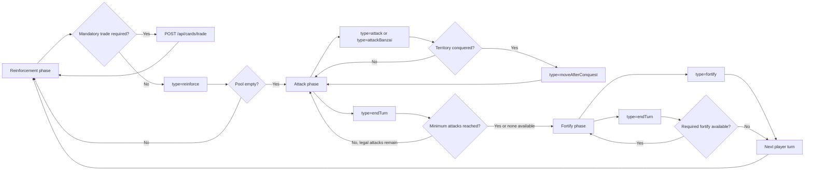
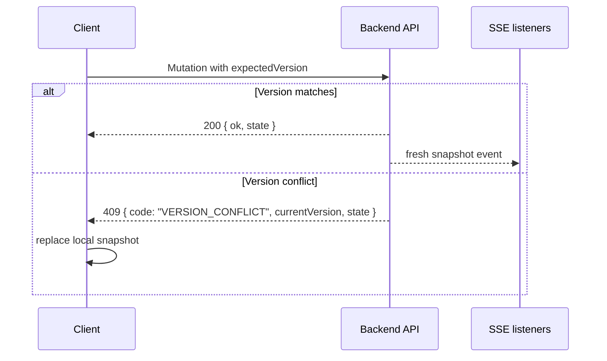

# NetRisk Gameplay Flows

These diagrams are derived from the current engine and regression tests in `tests/gameplay`. They describe the server-authoritative flow the UI has to follow.

## Game lifecycle

Notes:

- The game remains in `lobby` until a valid start request succeeds.
- `POST /api/games/open` does not mutate the rules flow; it rehydrates a saved snapshot, preserves modular setup metadata already stored in `gameConfig`, and can resume pending AI work before replying.
- Player surrender feeds the same victory detection path used by normal turn resolution.
- Authored victory objectives, when selected, are resolved at game creation and persisted into `gameConfig` so victory checks do not depend on admin lookups during a turn.

## Turn lifecycle

Notes:

- Reinforcements transition to attack only when the pool reaches zero.
- A conquest can force a post-combat movement before more attacks are allowed.
- `endTurn` from attack moves the game into `fortify` before advancing to the next player.
- Optional gameplay effects can require a minimum number of attacks or force a fortify when one is legally available.
- Configured turn timeouts are enforced by scheduled backend jobs and use the same backend-authoritative transition model as explicit player actions.

## Mutation transport and version conflicts

Notes:

- The backend owns the authoritative snapshot after every mutation.
- When the client receives a version conflict, the correct recovery path is to replace local state with the returned snapshot and retry only if the action is still valid.
