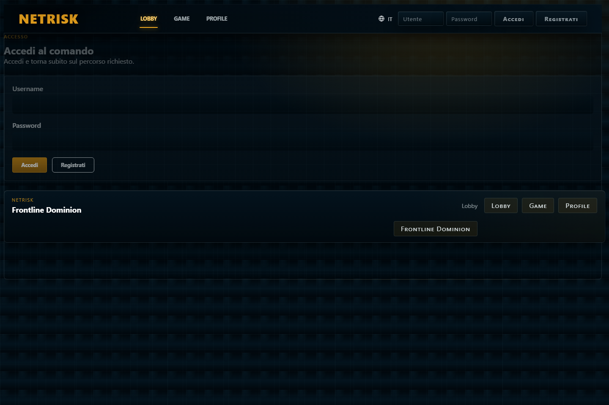
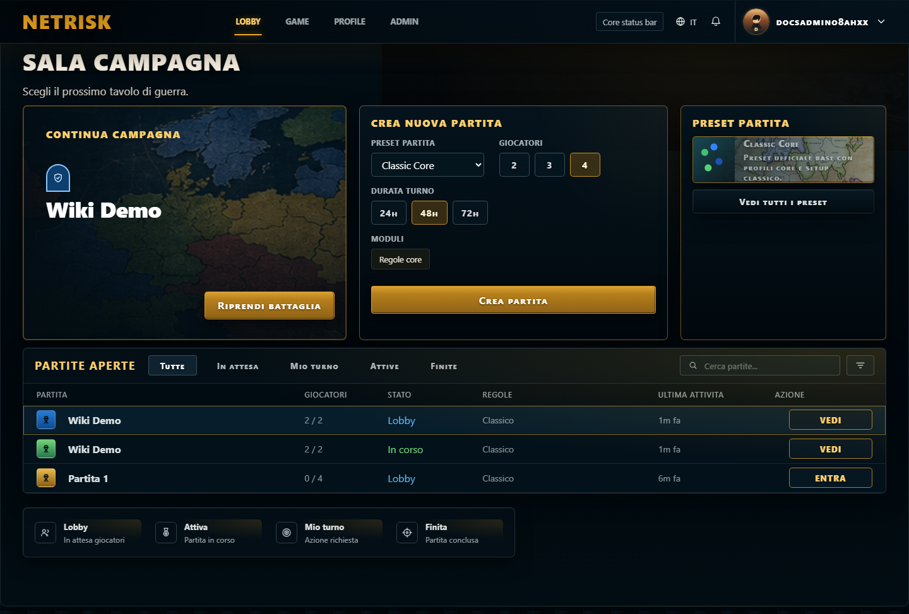
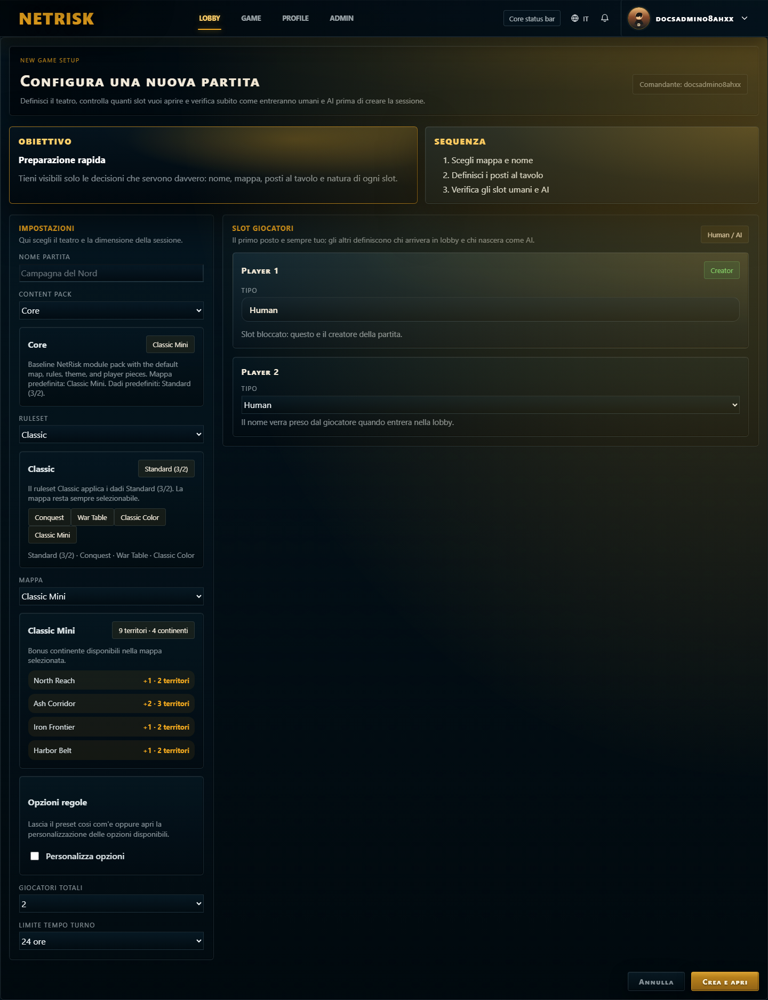
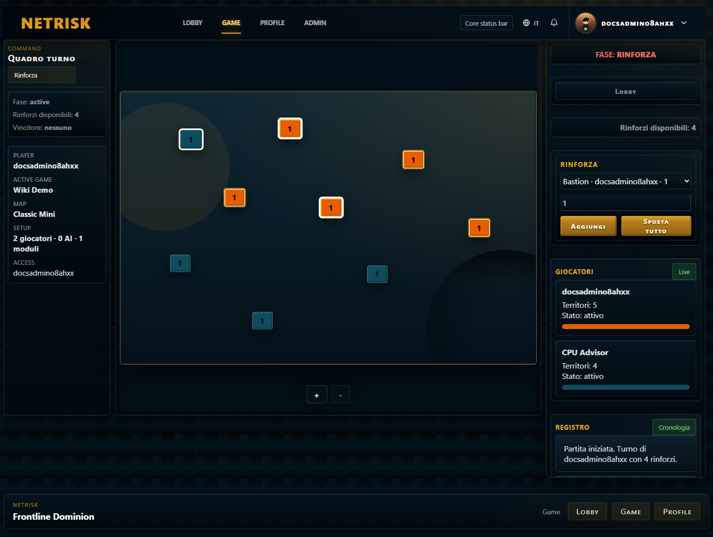
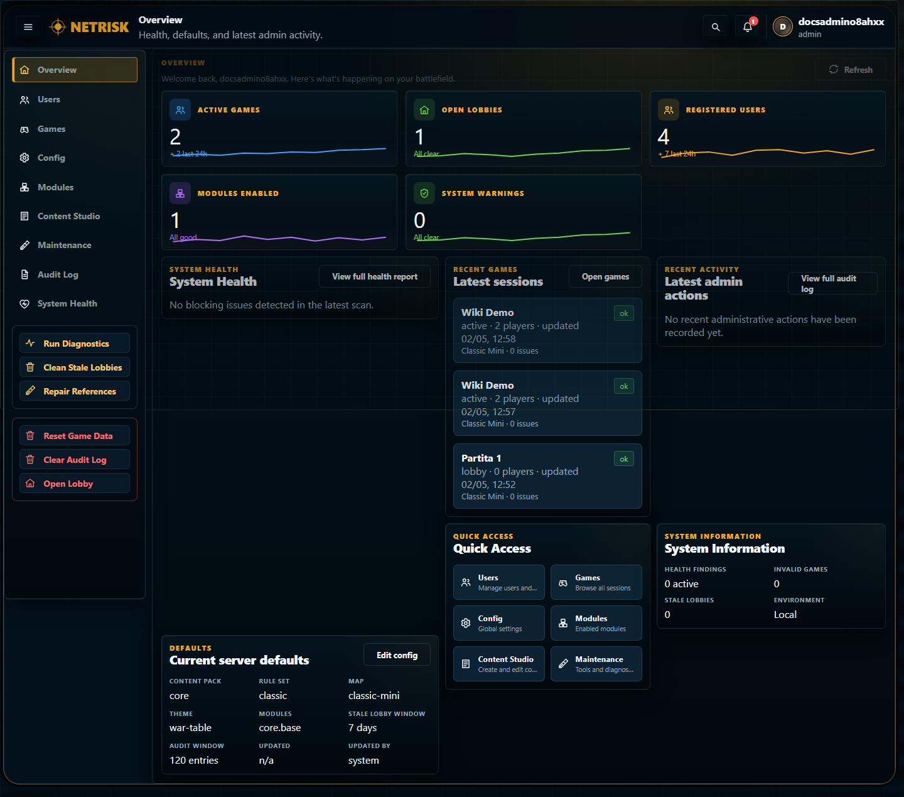

# Player and admin wiki

This guide explains how to use the game as a player or as an administrator. It does not describe code, APIs, or development workflows.

In the web interface the game can appear with the visible title `Frontline Dominion`. Technical documentation can still use the internal project name, but this player-facing guide avoids external franchise references.

## Guided walkthrough

### 1. Sign in

Use the sign-in screen to enter an existing account. New players can move to registration from the same entry flow. After signing in, the app opens the authenticated experience and lets you reach the lobby, profile, active games, and, for authorized users, the admin console.

### 2. Use the lobby

The lobby is the player hub. Use it to create a game, join an open lobby, return to a saved or active game, or add available bot players while setting up a match. A game can start only when its setup is valid, and the first player slot must be human.

### 3. Create a game

The new game screen is where the host chooses the map, rule preset, dice rule, victory condition, theme, piece style, player slots, bot slots, and turn timeout when those options are available. Confirm the setup, wait for the required players or bots, then start the game from the lobby.

### 4. Play on the board

The game board shows the current phase, territories, armies, players, available actions, combat results, cards, and turn controls. The server decides which actions are legal; the interface should only offer actions that match the current game state.

### 5. Manage the game as an admin

Authorized admins can open `/admin` to inspect users, games, active configuration, modules, Content Studio items, maintenance tools, health information, and audit logs. Admin tools manage the live game experience; they are not a code-editing interface.

## Player quick start

1. Open the application.
2. Register an account or sign in with an existing one.
3. Enter the lobby.
4. Create a game, join an open lobby, or reopen a saved game.
5. Use the profile page to check played games, wins, losses, ongoing games, and win rate.

## Lobby

The lobby is the starting point for matches.

You can:

- create a new game
- choose from the available maps
- select rule options allowed by the server
- set a turn timeout when available
- join an existing lobby
- add game-managed bots when the setup allows them
- reopen saved or active games

A game can start only when the setup is valid. The first slot must be occupied by a human player.

## Creating a game

When you create a game:

1. Choose the map.
2. Choose the available rule preset and options.
3. Choose human or bot slots.
4. Set the turn timeout, if available.
5. Confirm the setup.
6. Wait for the required players or add bots when allowed.
7. Start the game when all required slots are ready.

When the game starts, territories are assigned and the first turn begins.

## Match objective

The standard objective is to control the board by eliminating opponents or by completing the active victory condition.

The game detects eliminations, victory, and match completion automatically. If a game uses admin-authored objectives, the active objective is selected at game creation and remains stable for that match.

## Turn structure

Each turn follows three main phases:

- reinforcement
- attack
- fortify

The game shows only actions that are valid for the current phase. If an action is no longer allowed, the server rejects it and the screen refreshes to the correct match state.

## Complete rules

This section lists the operating rules players and admins need to understand the game.

### Game setup

- A new game requires 2 to 4 players.
- The first player slot must be human.
- Other slots can be human or bot-controlled when the setup allows them.
- The game can start only when the setup is valid.
- At game start, territories are distributed among players.
- Each territory starts with one army.
- The first active player starts in the reinforcement phase.
- Maps define territories, links between territories, continents, and continent bonuses.
- Available turn timeouts are 24, 48, or 72 hours when timeout selection is enabled.

### Presets and options

- `Classic` uses standard dice, conquest victory, the war-table theme, and classic-color pieces.
- `Classic Defense 3` uses the same base setup as `Classic`, but allows the defender to roll up to 3 dice.
- `Conquest` victory ends the match when only one active player still controls territories.
- `Majority Control` victory ends the match when one player controls at least 70% of the map territories.
- Admin-authored victory objectives can be published through Content Studio. Once used by a match, the selected objective stays fixed for that match.

### Reinforcements

- At the start of your turn, you receive reinforcements based on controlled territories.
- The standard calculation is `controlled territories / 3`, rounded down.
- The standard minimum is always 3 reinforcements.
- Continent bonuses are added when you control every territory in a continent.
- Reinforcements must be placed on territories you control.
- You cannot attack until all required reinforcements have been placed.
- If your hand is above the forced-trade limit, you must trade cards before continuing.

### Cards

- You can receive at most one card at the end of a turn.
- You receive that card only if you conquered at least one territory during the turn.
- Card types are infantry, cavalry, artillery, and wild.
- A valid trade set contains exactly 3 cards.
- A valid set can be three cards of the same type.
- A valid set can also be one infantry, one cavalry, and one artillery.
- Wild cards can complete either valid set shape.
- Standard trade bonuses are 4, 6, 8, 10, 12, and 15 reinforcements.
- After the sixth trade, each later trade adds 5 more reinforcements than the previous one.
- If you have more than 5 cards, trading becomes mandatory.
- Card names, descriptions, symbols, and rule effects are now provided by the active card module. The default module keeps the standard behavior above.

### Attacks

- You can attack only during the attack phase.
- You can attack only on your own turn.
- The attacking territory must be yours.
- The defending territory must belong to an opponent.
- The territories must be linked by the map.
- The attacking territory must have at least 2 armies because one army must stay behind.
- You must place all required reinforcements before attacking.
- Standard dice allow the attacker to roll up to 3 dice.
- Standard dice allow the defender to roll up to 2 dice.
- `Defense 3 Dice` allows the defender to roll up to 3 dice.
- The defender cannot roll more dice than the armies in the defending territory.
- Dice are sorted from highest to lowest and compared in pairs.
- Each comparison removes one army from the side with the lower result.
- Ties are won by the defender.
- Some configurations can require a minimum number of attacks or enforce a per-turn attack limit. The interface exposes only currently valid actions.

### Quick attack

- Quick attack repeats the same attack automatically while it remains legal.
- It stops when the territory is conquered.
- It stops when the attacker no longer has enough armies.
- It stops when the target is no longer enemy-controlled.
- It stops when a conquest move must be resolved.

### Conquest movement

- When a defending territory reaches 0 armies, ownership moves to the attacker.
- After conquest, you must move armies into the captured territory.
- You must move at least the match-required minimum.
- You must always leave at least one army in the source territory.
- You cannot continue the turn until the conquest movement is resolved.

### Fortify

- Fortify happens after the attack phase.
- You can move armies only between territories you control.
- Under standard rules, the territories must be adjacent.
- Under standard rules, you can fortify once per turn.
- You must move a positive whole number of armies.
- You must leave at least one army in the source territory.
- After fortifying, or after skipping fortify when allowed, the turn passes to the next player.

### End of turn, surrender, and victory

- If you conquered at least one territory during your turn, you can receive one card when the turn closes.
- A player with no active territories is eliminated from the match.
- A player can surrender when the action is available.
- Surrender discards that player's hand and removes the player from the active contest.
- If no human player remains active, the match can close without a human winner.
- The game checks victory after important actions such as conquest, surrender, and turn advancement.
- If a turn expires or an automated recovery is needed, the game can resolve pending state safely and advance the match.

## Phase guide

### Reinforcement phase

During reinforcement, place armies on territories you control.

You can:

- place reinforcements on your territories
- trade a valid card set for extra reinforcements
- complete the phase after all required reinforcements are placed

If you have too many cards, the game can require a trade before you proceed.

### Attack phase

During attack, choose one of your territories with enough armies and attack a linked enemy territory.

You can:

- choose the attacking territory
- choose the defending territory
- select the available dice count or attack option
- resolve combat
- keep attacking while you have valid attacks
- end the attack phase

If you conquer a territory, the game can require you to move armies into that territory before allowing other actions.

### Fortify phase

During fortify, move armies between territories you control when the connection is valid for the match rules.

You can:

- choose the source territory
- choose a valid destination territory
- choose how many armies to move
- confirm the move
- skip fortify when it is not mandatory

After fortify, the turn passes to the next player.

## Synchronization and conflicts

The server is the source of truth for the match. If two updates happen close together, the game can show a newer state and cancel a local action that is no longer valid.

In practice:

- if the screen refreshes after your action, check the current state before trying again
- if an action is no longer visible, the match has advanced or the phase has changed
- manual reload is usually unnecessary

## Player profile

The profile page summarizes your activity.

You can check:

- games played
- wins
- losses
- ongoing games
- win rate

## Admin guide

Admins can access the console at `/admin`. The admin entry is visible only to authorized users.

The console manages the game experience, users, content, modules, and operational state. It does not modify code.

## Admin sections

The console includes:

- `Overview`: operational summary, recent games, active configuration, and possible issues
- `Users`: user search, role inspection, admin promotion, and admin role removal
- `Games`: game list, status, players, setup, and management actions
- `Configurations`: global settings, enabled modules, profiles, and runtime defaults
- `Runtime / Modules`: available modules and their status
- `Content Studio`: controlled creation of supported gameplay content
- `Maintenance`: guided checks, cleanup, and repair actions
- `System Health`: diagnostics for games, modules, and configuration
- `Audit Log`: history of relevant admin actions

## Managing users

In `Users`, an admin can:

- search accounts
- check assigned roles
- promote a user to admin
- remove the admin role when it is no longer needed

Role changes can require a fresh sign-in or session refresh before they appear in the interface.

## Managing games

In `Games`, an admin can inspect matches and lobbies.

Available actions depend on the game state. Sensitive actions require explicit confirmation and are recorded in the audit log.

Use this section to:

- inspect stuck or obsolete games
- close or terminate games when the tool allows it
- verify setup and players
- gather details for player support

## Configurations and modules

Admin configuration affects the options available when players create new games.

Admins can manage:

- available maps
- selectable rule sets
- profiles and presets
- enabled modules
- maintenance settings

Already-created games keep the configuration they started with. Changing an admin default does not retroactively change active games.

## Content Studio

`Content Studio` lets admins create supported gameplay content, such as configurable victory objectives.

The typical flow is:

1. Create a draft.
2. Complete the required fields.
3. Validate the draft.
4. Publish it.
5. Enable it so it becomes available for new games.

Content created here is validated application data. It is not free-form scripting and does not run custom code.

## Maintenance and safety

Maintenance sections help admins keep the system orderly.

Before confirming destructive or repair actions:

- check which game, module, or configuration will change
- verify that the action matches the reported problem
- prefer targeted actions over broad cleanup
- review the audit log after important operations

The game still applies server-side checks when an action starts from the admin interface.

## Player best practices

- Finish your turn when you are done so the match keeps moving.
- Check the current phase before choosing an action.
- Use surrender only when you truly want to leave the contest.
- If the game refreshes the screen, trust the latest server state.

## Admin best practices

- Change defaults sparingly, especially while games are active.
- Use the audit log to reconstruct who did what.
- Publish new content only after validation.
- Avoid disabling modules that may still be used by active configurations.
- Tell players when available options for new games change.
